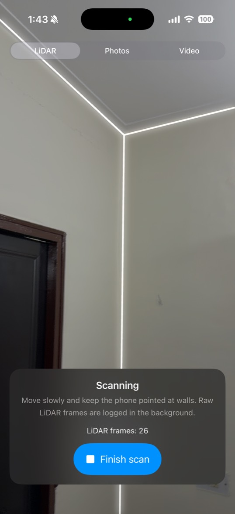
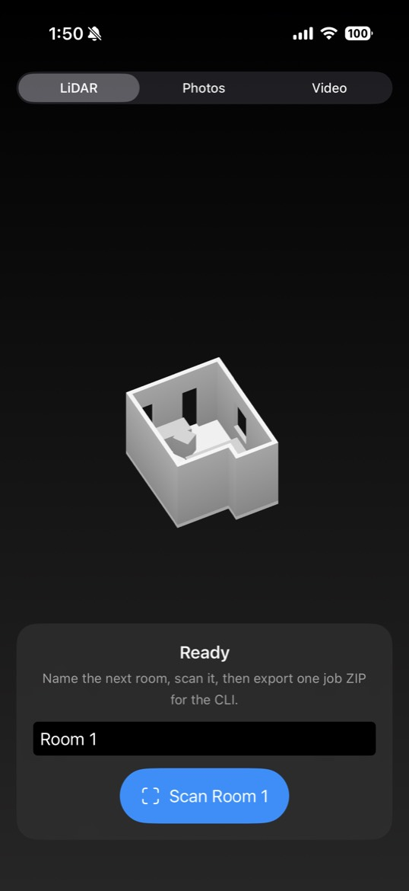
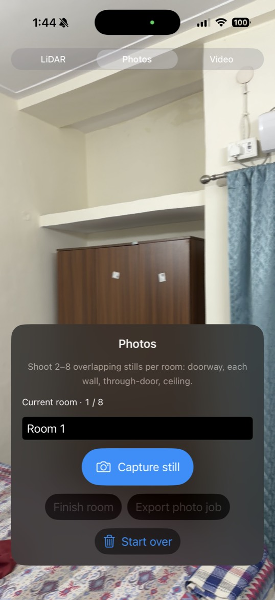
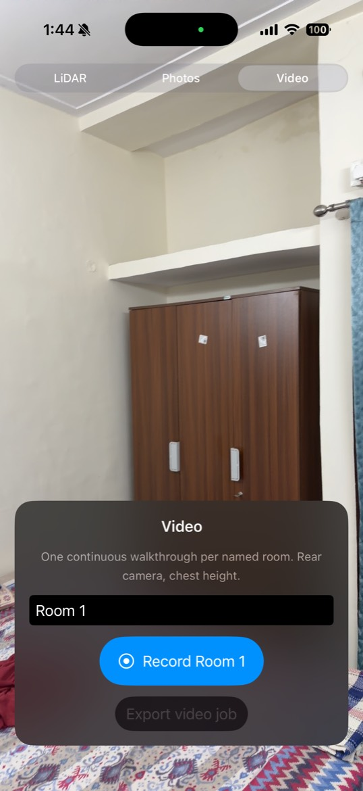
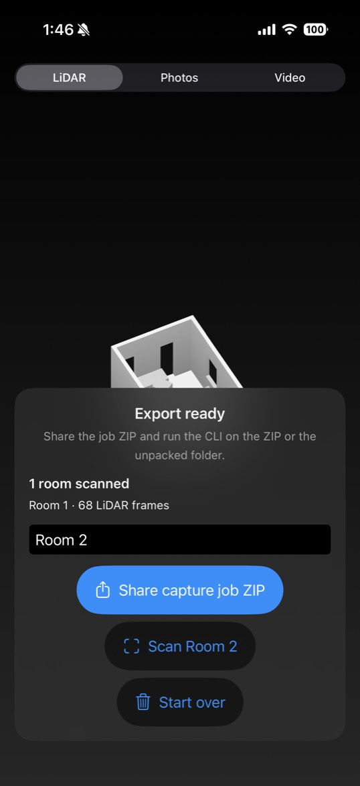
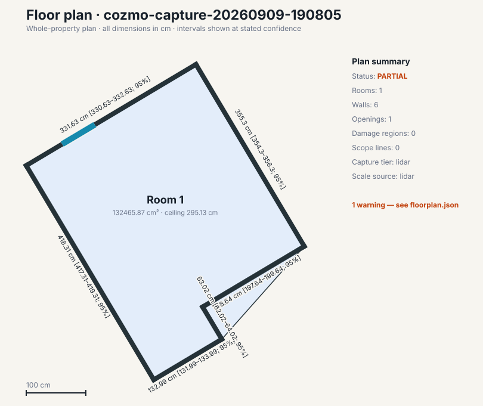
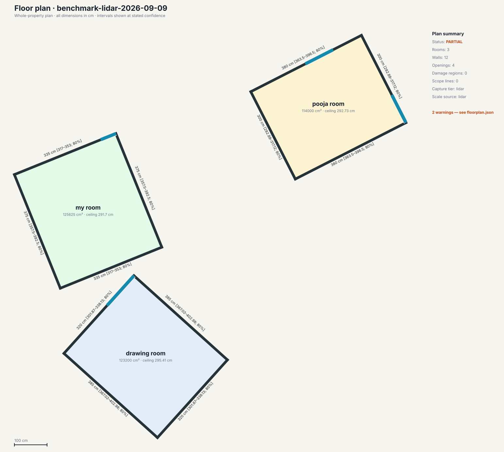
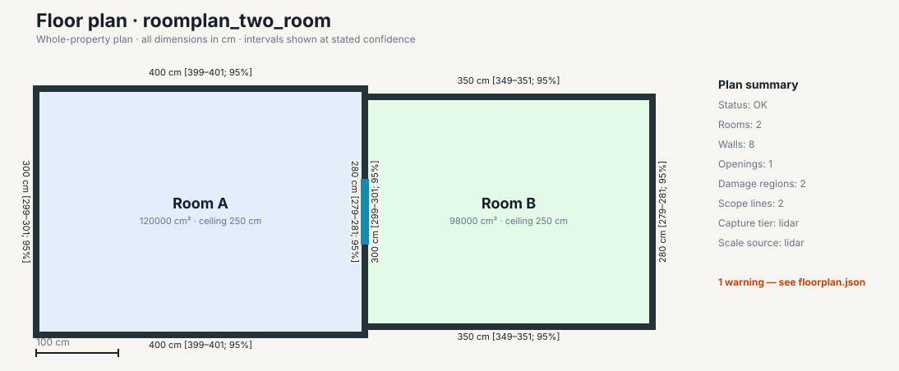

# Cozmo FloorPlan

My take-home for **Cozmo AI** (YC), for the **AI Backend Engineer** role. Cozmo is the AI operating system for property claims: field capture becomes structured loss data a downstream estimate agent can consume. This repository implements that primitive—a local pipeline, not a website, a magicplan clone, or a call into my infrastructure.

Official prompt: [docs/takehome.md](docs/takehome.md). Job brief: [docs/job-brief.md](docs/job-brief.md). Technical report: [docs/writeup.md](docs/writeup.md).

```text
python -m cozmo_floorplan run JOB --out OUT
```

One command turns a phone capture (photos, video, or LiDAR) into `floorplan.json` + `floorplan.svg`: walls, openings, ceiling, floor area, stitch, damage, concealed-rule flags, scope, and a confidence interval on every measurement.

## Submission status

I completed and exercised both allowed capture routes. Every scoring row has code, an evidence path, or an explicit measured status. That is **complete scoring coverage**, not a claim that every accuracy gate passes on the current captures.


| Scored area                  | Current evidence                                                                                                                                   |
| ---------------------------- | -------------------------------------------------------------------------------------------------------------------------------------------------- |
| Walk-in (30%)                | One-command CLI, both capture routes, and selected-tier harness are ready. A separate `mummy-room` semantic-USD holdout ran cold in 0.106 s and emitted geometry; its accuracy gates remain non-passing. |
| Fix loop (25%)               | Complete, checksum-locked, and regenerable in `data/fix-loop/`.                                                                                    |
| Three-tier benchmark (15%)   | All inputs run. Current outputs: photos `failed`, video `partial` (8 walls but non-passing accuracy), LiDAR `partial`; no unsupported tier is hidden. |
| Compliance (10%)             | All 27 requirements mapped in [docs/compliance-matrix.md](docs/compliance-matrix.md); incomplete geometry gates remain `partial`.                |
| Magicplan head-to-head (10%) | Magicplan 2026.35.0 on two rooms; the final LiDAR run ties or beats it on 9/12 shared dimensions (75%), passing the 70% gate.             |
| Capture route (5%)           | Route 2 is the scored route. Route 1 built in 46 s and copied to my iPhone in about 18s; total time approx 2.5 mins.                               |
| Process (5%)                 | Incremental source history across schema, CLI, reconstruction, agent, eval, iOS, and evidence stages.                                              |


The complete measured table, including non-passing rows, is in [docs/writeup.md](docs/writeup.md) §6.

## Both capture routes

The prompt allows **either** a native iOS app **or** a stock protocol. I built **both**.


| Route                | What shipped                                                                                                                                            | When to use it                                                                                                                    |
| -------------------- | ------------------------------------------------------------------------------------------------------------------------------------------------------- | --------------------------------------------------------------------------------------------------------------------------------- |
| **Route 2 (scored)** | One-page protocol: iPhone Camera + Record3D. Templates in `data/templates/`.                                                                            | Always. Print [docs/capture-route.md](docs/capture-route.md).                                                                   |
| **Route 1**          | Cozmo Capture: LiDAR (RoomPlan + ARKit `.r3d`), Photos, and Video in one job ZIP the CLI already ingests. Cable install; no paid TestFlight dependency. | Optional when a Mac, Xcode, and an unlocked iPhone are available. [docs/capture-route-route1.md](docs/capture-route-route1.md). |


## These paths ran

Same CLI, three inputs. The JSON is the product; the SVG is what a homeowner would recognise.

### Route 1 — Cozmo Capture app → CLI

Phone export `cozmo-capture-20260909-190805.zip` (`capture_tool: Cozmo Capture 0.1.0`). Command: `python -m cozmo_floorplan run cozmo-capture-*.zip --out out/route1`.

I ran the app on an iPhone 17 Pro: LiDAR / Photos / Video, followed by one job ZIP. The room mesh below is the on-device RoomPlan preview, not the CLI drawing.


| Scanning                                                                | Room on the phone                                                               |
| ----------------------------------------------------------------------- | ------------------------------------------------------------------------------- |
|  |                         |
| Photos                                                                  | Video                                                                           |
|      |                       |
| Export ZIP                                                              | CLI FloorPlan from that ZIP                                                     |
|             |  |


```json
{
  "status": "partial",
  "floor_id": "cozmo-capture-20260909-190805",
  "tier": "lidar",
  "scale_source": "lidar",
  "rooms": 1,
  "walls": 6,
  "openings": 1,
  "ceiling_cm": 295.13,
  "door_width_cm": 63.66,
  "warning": "incomplete_scan"
}
```

`partial` is the honest status: the first on-phone scan was mostly in-place, so the wall loop was open. The ZIP still reconstructed centimetres, a door, and an SVG. Regenerable copy: [docs/evidence/route1-cozmo-capture.json](docs/evidence/route1-cozmo-capture.json).

### Route 2 — Camera + Record3D → CLI

I captured three room `.r3d` archives with Record3D on the same iPhone 17 Pro. Command: `make benchmark` (LiDAR job).



```json
{
  "status": "partial",
  "floor_id": "benchmark-lidar-2026-09-09",
  "tier": "lidar",
  "rooms": ["drawing-room", "my-room", "pooja-room"],
  "openings": 4,
  "extents_cm": {
    "drawing-room": "380×305 (tape 368×305)",
    "my-room": "370×325 (tape 400×325)",
    "pooja-room": "365×295 (tape 370×290)"
  }
}
```

Three metric rooms, openings, and intervals from stock App Store capture. Regenerable copy: [docs/evidence/route2-record3d.json](docs/evidence/route2-record3d.json).

### Contract fixture — `make reproduce-synthetic`



```json
{
  "status": "ok",
  "floor_id": "roomplan_two_room",
  "rooms": 2,
  "openings": 1,
  "damage": 2,
  "pipeline_yield": "pass"
}
```

This is the 15-minute README path: schema-valid `ok`, yield pass, openings and ceilings at 0 cm on the fixture.

## What is stronger than a notebook

I shaped the project around the role’s production concerns: structured field data, agents with tools and fallbacks, reproducible evaluation, and explicit failure boundaries.

- **One contract, three sensors.** Photos, video, and LiDAR emit the same FloorPlan IR. One renderer, one eval, intervals that widen as the sensor thins.
- **Geometry owns centimetres.** An LLM with tools fills damage, concealed-rule ids, and scope. It cannot write wall lengths. Live OpenAI or the same tools offline — no call to Cozmo’s servers.
- **Evals that survive reproduction.** Official gates in centimetres, drift on vs off, photo/video repeats, Magicplan **2026.35.0** head-to-head, `make benchmark` regenerates the table.
- **Fix loop, not a post-mortem.** Declared failing yield, shipped code, checksum-locked before/after, readable diff (`data/fix-loop/`).
- **Own property, not only a fixture.** Three rooms are captured across all tiers, with connector evidence in photos/video; the missing connector LiDAR scan is reported. The benchmark also includes staged two-class damage, tape, a photo repeat, and a consumer-app export.
- **A path onto a phone.** Route 2 uses stock App Store apps. Route 1 is a real RoomPlan/ARKit exporter whose build and device-copy steps were well under ten minutes on my setup; use Route 2 if the complete install cannot be finished within ten minutes on your phone.

LiDAR room extents vs tape (Record3D, same three rooms):


| Room         | Predicted    | Tape         | Δ          |
| ------------ | ------------ | ------------ | ---------- |
| drawing-room | 380 × 315 cm | 368 × 305 cm | +12 / +10 cm |
| my-room      | 370 × 325 cm | 400 × 325 cm | −30 / 0 cm |
| pooja-room   | 370 × 295 cm | 370 × 290 cm | 0 / +5 cm |


Two short walls match tape exactly. The 30 cm `my-room` long wall is a supported 3.70 m plane, not a missing output. Thin LiDAR support contributes to the residual error, and the intervals widen when support weakens. Photos still lack a connected overlap graph. Native video now emits two partial rooms and eight walls, but its 356 cm median wall error is not gate-passing. The current LiDAR opening, ceiling, and registration rows also remain below their official gates. The LiDAR head-to-head passes at 75%. Full gate table: [docs/writeup.md](docs/writeup.md) §6.

The current photo/video misses are capture-quality-sensitive: the stills do not
form a connected overlap graph, and the handheld video is unstable with
incomplete wall/floor/ceiling coverage. A professional capture with 60%+ still
overlap, shared doorway views, corner pauses, and a slow stabilized video sweep
should provide materially stronger evidence. With additional capture time and
renewed Room 3D free/export-credit allowance, I would recapture and remeasure; the
submission does not relabel that expected improvement as a measured pass.

## Deliverables


| Official item                     | Where it lives                                                                                                                                                                               |
| --------------------------------- | -------------------------------------------------------------------------------------------------------------------------------------------------------------------------------------------- |
| Compliance matrix                 | [docs/compliance-matrix.md](docs/compliance-matrix.md)                                                                                                                                     |
| Capture route + device matrix     | [docs/capture-route.md](docs/capture-route.md) (scored) · [docs/capture-route-route1.md](docs/capture-route-route1.md) (optional app) · [docs/device-matrix.md](docs/device-matrix.md) |
| README to first run in 15 minutes | this file                                                                                                                                                                                    |
| Reproduction bundle               | `make reproduce-synthetic` · `make benchmark` · [docs/reproduction.md](docs/reproduction.md) · [data/fix-loop/](data/fix-loop/)                                                          |
| Benchmark report                  | [docs/writeup.md](docs/writeup.md) §6 · `out/benchmark/` after `make benchmark`                                                                                                            |
| Fix loop                          | [docs/fix-loop.md](docs/fix-loop.md) · [data/fix-loop/](data/fix-loop/)                                                                                                                  |
| Technical report ≤ 6 pages        | [docs/writeup.md](docs/writeup.md)                                                                                                                                                         |
| FloorPlan schema                  | [docs/schemas/floorplan.schema.json](docs/schemas/floorplan.schema.json)                                                                                                                   |
| Raw benchmark                     | gitignored `data/private/` (photos, video, Record3D, tape, Magicplan 2026.35.0)                                                                                                              |


## Setup (under 15 minutes)

Python 3.11+ (3.12 verified). No Redis, no hosted API of ours.

```bash
python3 -m venv .venv
source .venv/bin/activate
pip install -r requirements.txt
pip install --no-deps -e .
make test
make reproduce-synthetic
```

On a fresh macOS arm64 Python 3.12 venv this path was **28.37 s** end-to-end (venv, install, tests, synthetic run, eval, fix-loop verify). Details: [docs/reproduction.md](docs/reproduction.md).

For live damage/scope, copy `.env.example` to `.env` and set `OPENAI_API_KEY`. Default `COZMO_AGENT_MODE=auto` uses OpenAI when the key exists and the same tools offline otherwise. Never commit `.env`. Never point the agent at Cozmo servers.

## One command per capture

```bash
python -m cozmo_floorplan run path/to/job --out out/run
```

Open:

- `out/run/floorplan.json` — schema-valid plan, damage, concealed flags, scope, intervals
- `out/run/floorplan.svg` — whole-property drawing
- `out/run/floorplan.ablation-off.json` — poses-as-is stitch, when a multi-room graph exists

Evaluate (repeat, ablation, and incumbent flags are optional):

```bash
python -m cozmo_floorplan eval \
  --pred out/run/floorplan.json \
  --truth path/to/ground_truth.json \
  --out out/run
```

Same command with a Cozmo Capture ZIP:

```bash
python -m cozmo_floorplan run path/to/cozmo-capture-*.zip --out out/route1
```

Regenerate every public number:

```bash
make reproduce-synthetic
```

Regenerate the private benchmark (photos, video, LiDAR, photo/video repeats, Magicplan, tape):

```bash
make benchmark
```

Review `out/benchmark/benchmark-summary.md`. Measured gates are in [docs/writeup.md](docs/writeup.md).

## Job folder formats

Start from the matching folder under `data/templates/`, edit its `manifest.yaml`, and preserve original media. Raw captures and generated `out/` artifacts are intentionally Git-ignored.

```text
photos-job/                     video-job/                 lidar-job/
├── manifest.yaml              ├── manifest.yaml          ├── manifest.yaml
└── photos/                    └── video/                 └── lidar/
    ├── room-a/                    └── walkthrough.mov        └── capture.r3d
    │   └── 01-doorway.jpg
    └── room-b/
        └── 01-doorway.jpg
```

- Photos: 2–8 JPEGs per room; the benchmark route requests eight overlapping views.
- Video: one original 1080p MOV/MP4 walkthrough; calibrated pose sidecars are supported when available.
- LiDAR: an original Record3D `.r3d`, portable RoomPlan JSON, or a semantic `.usd` / `.usda` / `.usdz` room mesh.
- Route 1: pass the exported Cozmo Capture ZIP directly; no manual unpacking is required.

Exact contracts: [data/templates/README.md](data/templates/README.md), [docs/formats/photo-job.md](docs/formats/photo-job.md), [docs/formats/video-job.md](docs/formats/video-job.md), and [docs/formats/record3d.md](docs/formats/record3d.md).

## Walk-in capture route

Both routes are implemented. **Use Route 2 by default** unless the Route 1 cable install finishes in under 10 minutes on your phone. Use iPhone Camera for photos and video, and **Record3D** for LiDAR on a Pro model. Do not use Polycam or magicplan as the capture tool; those are incumbent products for the head-to-head comparison (Magicplan **2026.35.0**).


| Tier   | Device               | What to hand the CLI                                |
| ------ | -------------------- | --------------------------------------------------- |
| Photos | iPhone 15+           | 2–8 JPEGs per room under `photos/<room>/`           |
| Video  | iPhone 15+           | one 1080p MOV/MP4 walkthrough                       |
| LiDAR  | iPhone Pro / Pro Max | original Record3D `.r3d` (depth, poses, intrinsics) |


Copy a template, replace `replace-me`, then run `python -m cozmo_floorplan run JOB --out OUT`. Templates: `data/templates/`.

## Install the iOS app (Route 1)

Route 1 is not a stub. Cozmo Capture is a native iOS 17 app: RoomPlan walls, 2 Hz ARKit RGB-D into Record3D-compatible `.r3d`, Photos (2–8 stills/room), Video walkthroughs, and a shareable ZIP the Python CLI unpacks. The official prompt allows TestFlight **or** a cable development build in under 10 minutes; this submission uses the cable path.

On a Mac with Xcode and this repo, plug in an unlocked iPhone:

```bash
./scripts/install-cozmo-capture.sh
open -a Xcode ios/CozmoCapture/CozmoCapture.xcodeproj
```

These commands are also available as `make install-capture-app` and `make open-capture-app`. Print [docs/capture-route-route1.md](docs/capture-route-route1.md). On my iPhone 17 Pro, the signed iPhoneOS build took 46 seconds and the device copy took about 18 seconds.

If Developer Mode needs a restart, or the laptop is not a Mac with Xcode, stay on Route 2.

After a scan, AirDrop the ZIP and run `python -m cozmo_floorplan run ~/Downloads/cozmo-capture-*.zip --out out/route1`.


For the live walk-in, choose photos, video, or LiDAR, follow [docs/capture-route.md](docs/capture-route.md) literally, and run:

```bash
python -m cozmo_floorplan run JOB --out OUT
```

Measure the room with a laser while the pipeline runs. Set `OPENAI_API_KEY` if live agent calls are available; otherwise the same tools run through the deterministic fallback. Use `python -m cozmo_floorplan run` for the new capture rather than `make benchmark`, which targets my private development benchmark. A rehearsal harness exists (`make walkin`, [docs/walk-in.md](docs/walk-in.md)) for a room that is not `drawing-room`, `my-room`, `pooja-room`, or `connector`. On evaluator day, `make walkin WALKIN_TIER=video` (or `photos` / `lidar`) checks only the chosen tier and reports geometry readiness plus the exact recapture action.

## Design in one paragraph

One FloorPlan IR for photos, video, and LiDAR. Centimetres come from geometry. An LLM **agent with tools** fills damage, concealed-damage rules, and scope (disclosed public API + fallback). Eval reports official gates in centimetres. Device coverage and measured intervals: [docs/device-matrix.md](docs/device-matrix.md).

## Ground rules

- Python 3.11+ (3.12 is fine).
- Deterministic jobs: same `job/` in, same JSON out.
- Headless tests (`opencv-python-headless`).
- No website, no Redis, and no calls to **my** servers.
